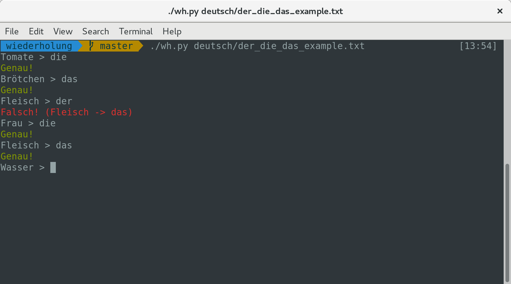
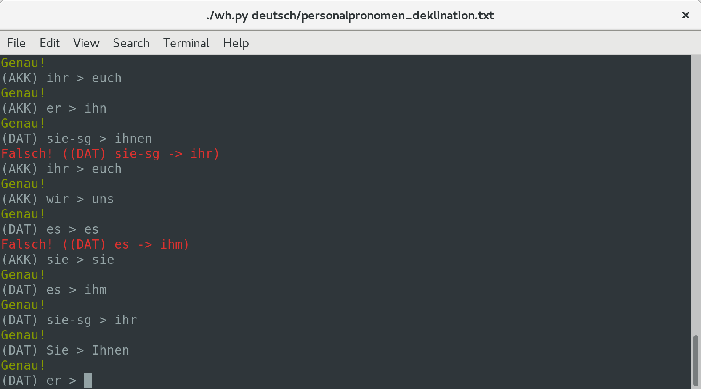
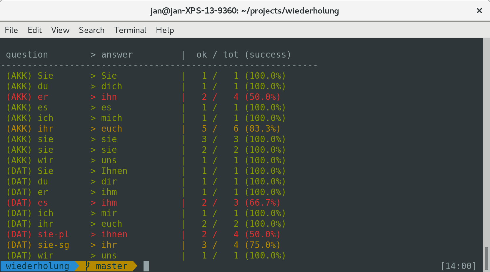

# die Wiederholung

**Repetition game for language learning**

## Introduction

The game takes a list of questions and correct answers, and presents the
questions to the user in random order. User must then provide the correct
answer. Although quite simple, this system provides a convenient way to solidify
knowledge of certain "mappings" which are needed to speak a language. E.g.
in German, noun gender plays an important role.

The game can be modified or extended by providing new CSV files.

## Screenshots

